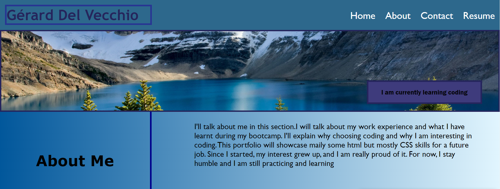

# <Portfolio Gerard  Del Vechio>

## Description

I wanted to create a portfolio page with my potential work

with my name, a recent photo or avatar, and links to sections about me, my work, and how to contact me

WHEN I click one of the links in the navigation
THEN the UI scrolls to the corresponding section
WHEN I click on the link to the section about my work
THEN the UI scrolls to a section with titled images of my applications
WHEN I am presented with my first application
THEN that application's image should be larger in size than the others
WHEN I click on the images of the applications
THEN I am taken to that deployed application
WHEN I resize the page or view the site on various screens and devices
THEN I am presented with a responsive layout that adapts to my viewport

## Table of Contents (Optional)
N/A

## Installation
click on the link
https://github.com/Gdel-J/challenge-2-Gerard-Del-Vecchio.git

## Usage

A small presentation of my work

  

## Credits

N/A

## License

N/A
## Badges

N/A
## Features

N/A

## How to Contribute

## Tests

N/A